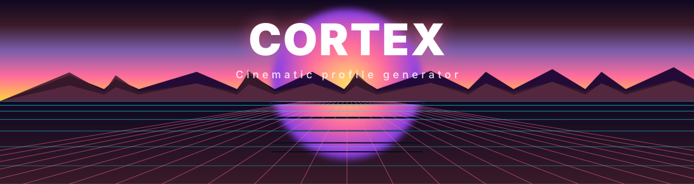
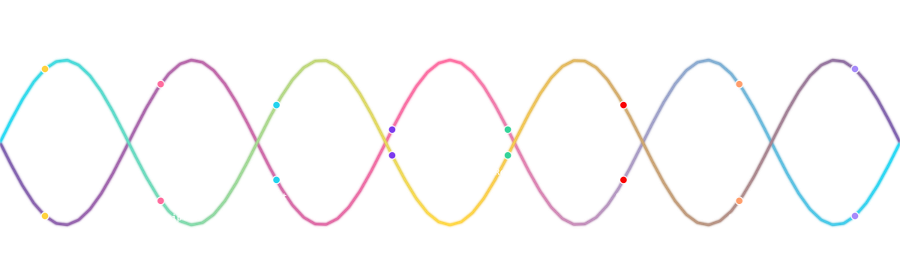
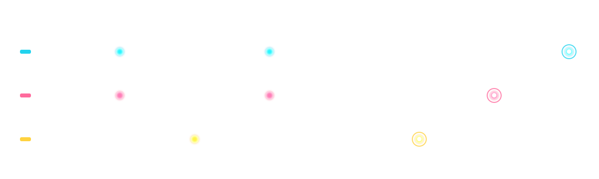
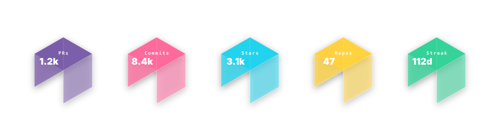

  

  

  
  
  

  &nbsp;&nbsp;&nbsp;&nbsp;
  &nbsp;&nbsp;&nbsp;&nbsp;
  &nbsp;&nbsp;&nbsp;&nbsp;
  

  

---

  

### ⚡ About Me

I am a passionate **Web Developer** who loves building beautiful, responsive, and interactive user interfaces. Beyond the frontend, I dive deep into Python automation scripting, backend engineering, and AI integrations to construct end-to-end applications.

🚀 **What I do:**

- 🖥️ **Frontend:** Crafting elegant interfaces with Next.js, React.js, HTML5, and CSS3.
- ⚙️ **Backend:** Architecting robust backends using Python, Django, Django REST Framework, Celery, and PostgreSQL.
- 🤖 **AI Engineering:** Exploring the future of AI with LangChain and OpenAI APIs.

🌍 **Languages I Speak:**

- 🇮🇷 Persian (Native)
- 🇬🇧 English (Fluent)
- 🇩🇪 German (Beginner)

💡 **My Philosophy:** Combine front-end elegance with robust back-end AI automation to create systems that truly feel alive.

  

  

  

  

  

---

### 🛠️ Tech Stack & Toolbox

  

  

  

---

<!-- ### 🏆 GitHub Trophies & Contributions -->

<!--

  

-->

  

---

  

### 📊 GitHub Activity & Stats

  

  

  
  

  

---

  

  

